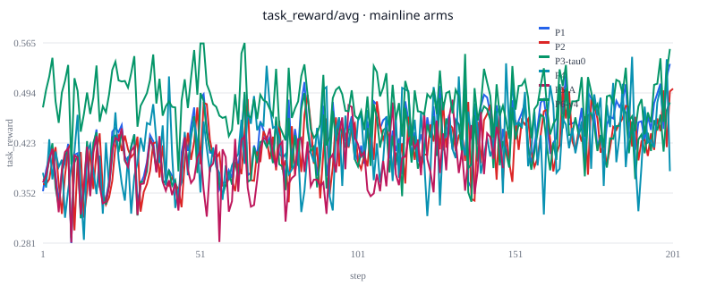
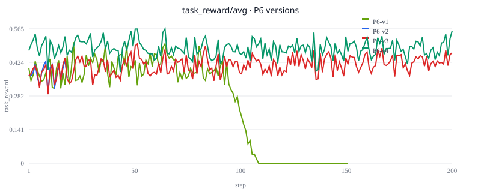

# k3-align

> **Scope:** open ablation testbed inspired by K3 §4.1 (arXiv:2607.24653), with **approximate** mechanisms on AReaL (vLLM rollout + FSDP actor). Citations should treat this repo as an independent protocol and artifact bundle — separate from Kimi K3's full system and paper leaderboard numbers.

> **Boxed percentages are same-batch internal metrics.**  
> P0–P6 **boxed** values use **N=256 · greedy · seed=1 · `MATH-lighteval` test**, drawn in **fixed batches** (e.g. `batch_p1_p2_p3` vs `batch_p6_v4`). Cross-batch absolute % mixes different eval draws and checkpoint context, so deltas like P1 vs P2 or P6-v4 vs P1 are meaningful **only within a labeled batch**. A headline such as 79.3% reflects that batch and protocol, not a universal MATH/SOTA benchmark.

> **Published numbers come from Hopper multi-node actor/rollout split.**  
> Full trials used **multi-GPU Hopper (96GB HBM)** with **actor and rollout on different nodes** (16–24 GPU configs). Throughput, boxed %, and train curves shift on A100/consumer GPUs, single-node layouts, or colocated actor+rollout. Qualitative ablation conclusions (H tradeoff, λ audit, OPD failure modes) transfer more reliably than the quantitative table entries.

Open **one-factor-at-a-time ablation lab** for K3-§4.1-style RL knobs.

| Doc | Role |
|-----|------|
| [`docs/TECH_REPORT_P0_P6.md`](docs/TECH_REPORT_P0_P6.md) | Full design + results |
| [`docs/REPRODUCIBILITY.md`](docs/REPRODUCIBILITY.md) | Claim→artifact map; Tier-1/2 repro |
| [`docs/curves/COMPARE.md`](docs/curves/COMPARE.md) | Train convergence curves (CSV + SVG) |
| [`.env.example`](.env.example) | Environment variable template |
| [`LICENSE`](LICENSE) | MIT |

## What you can do without a cluster

| Tier | GPU | Command | What it proves |
|------|-----|---------|----------------|
| **Tier 1** | **None** | `./scripts/verify.sh` | Checked-in boxed JSON + curves still match documented claims (C0–C7) |
| **Tier 1b** | 1 GPU (optional) | `python3 scripts/math_boxed_probe.py --model <hf_or_ckpt> …` | Re-run the **eval script** on your hardware (absolute % is batch-local on that run) |

**Tier 2** (smoke → full train → boxed → curves) requires the SAO+AReaL stack, **16–24 GPUs**, and Ray topology env vars — see [Quickstart](#quickstart).

## What this is

- Same model/data/recipe base; **change one factor per phase** (P0–P6).
- Auditable **approximate** mechanisms: async head `H`, `approx λ-partial`, `approx Effort`, `approx MOPD` (single teacher).
- First-class **negative results** (especially MOPD v1–v3); failures are classified below.
- Checked-in **per-step reward / seq_len curves** for every full trial.

## P6 failure summary (algorithm vs engineering)

| Version | Outcome | Primary cause class | One-line diagnosis |
|---------|---------|---------------------|-------------------|
| **v1** | VOID (~151/200) | **Engineering** + signal scale | `disk` weight sync + α too small without length-norm → reward collapse / HTTP 500 |
| **v2** | VOID (~19/200) | **Engineering** | Same as v1 but **NFS/GPFS** shard-write tail → >120s sync timeout |
| **v3** | FAIL boxed (72.3%) | **Algorithm / signal** (under this approx setup) | Training completes with **xccl**; **Instruct cold start** → systematic **negative OPD bias** (−6.25pp vs same-batch P1) |
| **v4** | PASS boxed (79.3%) | Repair path | **P1 warm-start** + **pos-only OPD** + xccl + length-norm |

Detail: [`docs/P6_PLAN.md`](docs/P6_PLAN.md), [`docs/P6_COMPARE.md`](docs/P6_COMPARE.md).

## Contributions

1. **Ablation suite** — protocol + smoke/boxed gates for §4.1-style knobs on an open stack.
2. **Auditable approx implementations** — JSONL audits and explicit Diff vs paper namesakes.
3. **OPD failure modes + repair** — engineering timeouts vs cold-start signal bias; repair via length-norm, xccl, P1 warm-start, pos-only.
4. **Multi-node async RL ops notes** — weight-sync when actor/rollout split; same-batch eval conventions.
5. **Negative-result artifacts** — VOID/FAIL trials kept in docs, not only the winning checkpoint.
6. **Transparent convergence** — StatsLogger series + overlay SVGs under `docs/curves/`.

## Phase map (short)

Boxed % below are **same-batch relative** metrics — each row's delta assumes the eval batch named in [`REPRODUCIBILITY.md`](docs/REPRODUCIBILITY.md).

| Phase | One change | Metrics | Status |
|-------|------------|---------|--------|
| P0 | Cold-start gate | boxed **65.625%** (168/256) | Instruct pass (no RL curve) |
| P1 | Sync + recipe R, H=0 | boxed **78.125%**; train reward 0.38→0.47 | Sync ceiling |
| P2 | H=4 only | boxed **75.000%** (−3.125pp vs P1); throughput **+31.9%** steps/h | Throughput pass; boxed soft-fail |
| P3 | τ_R / mask sweep | boxed **75.781%** (τ_R=0; +0.78pp vs P2) | ≈P2 |
| P4 | approx λ=0.5 | boxed **74.219%** (−1.95pp vs same-batch P2 76.172%) | Mechanism pass |
| P5 | approx Effort | boxed **76.953%** (+0.78pp vs same-batch P2); gen len **−2.1%** | Pass vs P2 |
| P6 | approx MOPD | v3 boxed **72.266%**; **v4 79.297%** (+0.78pp vs same-batch P1 78.516%) | v1–v3 fail; **v4 pass** |

## Convergence (preview)

Main metric: `ppo_actor/task_reward/avg`.





Rebuild from a trial `main.log`:

```bash
python3 scripts/extract_train_curves.py \
  --log path/to/<trial>/main.log --trial <trial> --out docs/curves/
python3 scripts/plot_train_curves.py --curves-dir docs/curves
```

## Repo layout

```text
configs/          # per-phase YAML (+ smoke/) — see configs/README.md
pythonpath/       # boot hooks (λ / Effort / MOPD / recipe R)
scripts/          # entrypoints — see scripts/README.md
  lib/env.sh      # shared K3_ROOT / SAO_ROOT
  verify.sh       # Tier-1 claims C0–C7
  rebuild_curves.sh
  launch_*.sh     # Ray + train
  run_boxed_*.sh  # same-batch MATH gates
docs/             # report, REPRODUCIBILITY, curves, boxed
.env.example      # copy → .env (gitignored)
```

## Upstream pins (required for Tier-2 retrain)

k3-align **does not vendor** [SAO](https://github.com/fooSynaptic/Single-rollout-async-Optimization) or AReaL. Upstream drift breaks bootstrap, patches, and YAML assumptions.

| Layer | Repository | Branch | Commit pin |
|-------|------------|--------|------------|
| **SAO** | [Single-rollout-async-Optimization](https://github.com/fooSynaptic/Single-rollout-async-Optimization) | **`main`** | **`ac2728149041b5f15ceb75413f467ce0659179cf`** (2026-07-27) |
| **AReaL** | [inclusionAI/AReaL](https://github.com/inclusionAI/AReaL) | detached @ pin | **`3cf0dfbd2b0fbeabd6977184980e189d1567747a`** (via SAO `bootstrap_areal.sh`) |
| **k3-align** | this repo | your replay branch | match the commit whose artifacts you reproduce |

Machine-readable copy: [`docs/manifests/upstream_pins.json`](docs/manifests/upstream_pins.json).

Bootstrap (from **inside SAO**, not k3-align):

```bash
git clone https://github.com/fooSynaptic/Single-rollout-async-Optimization "$SAO_ROOT"
git -C "$SAO_ROOT" checkout ac2728149041b5f15ceb75413f467ce0659179cf
cd "$SAO_ROOT"
INSTALL=1 INFERENCE_BACKEND=vllm bash scripts/bootstrap_areal.sh
# → AReaL @ 3cf0dfbd… + areal-sao.patch → $SAO_ROOT/vendor/AReaL (or AREAL_ROOT)
python scripts/prepare_math.py --output "$SAO_ROOT/data/gsm8k_hard"
```

After bootstrap, both SHAs should match the table:

```bash
git -C "$SAO_ROOT" rev-parse HEAD      # ac2728149041b5f15ceb75413f467ce0659179cf
git -C "$AREAL_REPO" rev-parse HEAD    # 3cf0dfbd2b0fbeabd6977184980e189d1567747a
```

If bootstrap or patch apply fails, the SAO/AReaL pair is incompatible with this repo's configs — align pins before debugging k3-align YAML.

## Quickstart

### 0. Environment template

```bash
cp .env.example .env
# Edit .env — see scripts/README.md §0 for variable meanings
set -a && source .env && set +a
export K3_ROOT="${K3_ROOT:-$PWD}"
```

| Variable | Required for | Notes |
|----------|--------------|-------|
| `K3_ROOT` | always | This repo root |
| `SAO_ROOT`, `AREAL_REPO`, `VENV` | Tier-2 train/eval | After SAO bootstrap |
| `MODEL_PATH`, `DATA_PATH` | Tier-2 | `Qwen3-4B-Instruct-2507` + `gsm8k_hard` |
| `HEAD_SSH`, `HEAD_HOST`, `WORKER_SPECS` | Tier-2 **train** | Ray topology; **no defaults** in repo |
| `HOST_A`, `HOST_B` | Tier-2 **boxed** scripts | SSH aliases with spare GPUs |

Hydra resolves paths via `oc.env` (`K3_ROOT`, `MODEL_PATH`, `DATA_PATH`, `AREAL_REPO`, `VENV`, `SITE`). See [`configs/README.md`](configs/README.md).

### 1. Tier 1 — verify artifacts (no GPU)

```bash
export K3_ROOT=$PWD
./scripts/verify.sh
```

### 2. Tier 2 — smoke → full → boxed → curves (multi-node cluster)

```bash
export K3_ROOT=$PWD
# SAO_ROOT / AREAL_REPO / VENV / MODEL_PATH / DATA_PATH / HEAD_SSH / HEAD_HOST / WORKER_SPECS from .env

bash scripts/run_p6_smoke.sh          # example smoke (still needs cluster + GPUs)
bash scripts/launch_p6_24gpu.sh full
bash scripts/run_boxed_p6.sh          # also needs HOST_A / HOST_B
bash scripts/rebuild_curves.sh
./scripts/verify.sh
```

Launch wrappers require `HEAD_SSH`, `HEAD_HOST`, and `WORKER_SPECS` (no baked-in cluster hosts). Checked-in **docs** omit internal hostnames.

There is **no single-GPU full-training path** in this repo (configs assume 16–24 GPU actor/rollout split). For a minimal GPU smoke of **eval only**:

```bash
python3 scripts/math_boxed_probe.py \
  --model "$MODEL_PATH" --tag local_smoke --out /tmp/boxed_smoke.json --n 8 --seed 1
```

### Dependencies

No standalone `requirements.txt` — Python deps live in the SAO AReaL venv created by `INSTALL=1 … bootstrap_areal.sh`.

## Citation / relation to K3

Inspired by Kimi K3 §4.1 training ideas. The **K3 paper** carries the official algorithm formulation; **this repository** documents the open ablation protocol, approximate mechanisms, failure analysis, and checked-in artifacts.

```bibtex
@misc{k3-align,
  title={kimi3-align: Open One-Factor Ablation Testbed for K3-Style RL Mechanisms on AReaL},
  author={fooSynaptic},
  year={2026},
  howpublished={GitHub repository, \url{https://github.com/fooSynaptic/k3-align}},
  note={Not an official K3 reproduction; boxed metrics are same-batch internal comparisons}
} 
```
