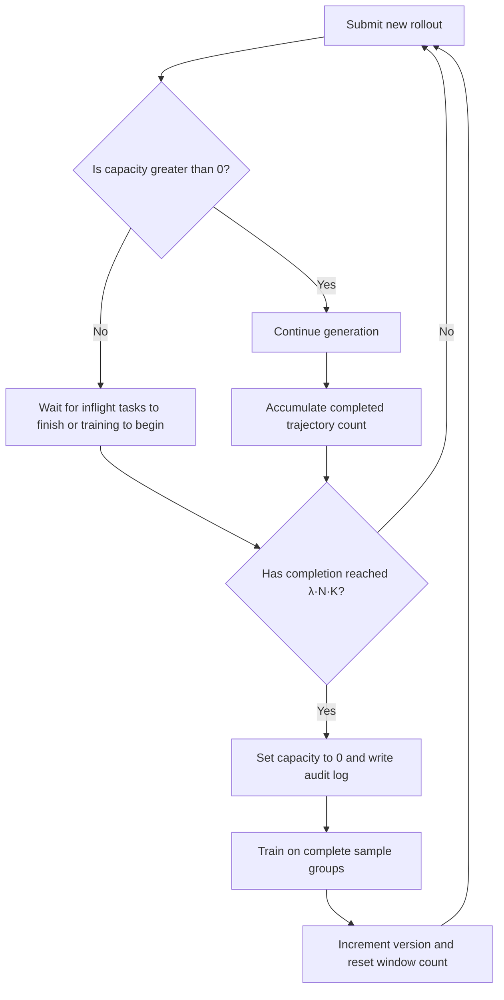

# P4 λ-barrier Plan (B · Weak Approximation)

## Scope and Claim

- **Included**: add **new-request admission pause at a λ completion fraction** and **auditable JSONL scheduling logs** to the P2 recipe (`H=4`, K2.5-style R).
- **Excluded (v1)**: complete sandbox state machine, priority queue for resuming unfinished trajectories across steps, MuonClip, and λ schedule sweeps.
- **Reporting**: `approx λ-partial`; **not equivalent to** the paper's complete C1; **not** another adjustment to `max_head_offpolicyness`.

Fixed hyperparameter: `λ=0.5`; control baseline = completed trial `p2-k25-async-h4`.

In one sentence: **after completing about half (λ=0.5) of the target trajectories in the current window, stop accepting new requests → wait for inflight work to finish → train → increment the version and clear the window → start the next round.**

## Fixed Knobs

| Item | Value |
|------|-------|
| Baseline recipe | P2 · R · `H=4` · Instruct |
| λ | 0.5 |
| Topology | 16× Hopper (96GB HBM): `vllm:d4` + `fsdp:d12` · batch=168 (must be divisible by 12) |
| Full-run steps | 200 |

## Code Entry Points

- [`pythonpath/lambda_barrier.py`](../pythonpath/lambda_barrier.py) — monkeypatch `StalenessManager` + `BatchTaskDispatcher.active_submit_and_wait`
- [`pythonpath/p4_boot.py`](../pythonpath/p4_boot.py) — environment switch
- Launch: `scripts/launch_p4_16gpu.sh {smoke|full}`

## Success Criteria

1. Smoke: util≥50%; audit contains `pause` (plus `train`/`reset`).
2. Full: 200 steps; compare throughput/staleness/reward against P2; run boxed evaluation on the final checkpoint.
