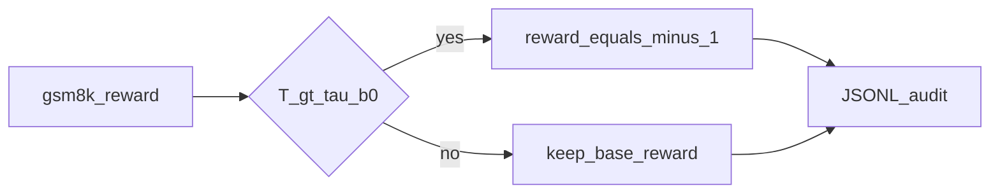

# P5 Effort Plan (approx · MVP)

## Scope and Claim

- **Included**: add an **Effort hard gate** to the P2 recipe (`H=4`, K2.5-style R, no λ): if \(T(y) > \tau\cdot b_0\), set `reward=-1`; otherwise retain the original `gsm8k` reward.
- **Excluded (v1)**: per-prompt \(b_0(x)\), multiple effort experts, MOPD, λ-barrier, and changes to H / αβτ.
- **Reporting**: `approx Effort` (global \(b_0\) + two-stage \(\tau\)); **not equivalent to** the paper's complete Reasoning Effort suite.
- **Reward path**: custom hard gate in [`effort_reward.py`](../pythonpath/effort_reward.py) — AReaL `overlong_reward_penalty` applies a DAPO soft tail, which behaves differently from K3's −1 over-budget penalty, so P5 keeps that hook disabled.

## Fixed Knobs

| Item | Value |
|------|-------|
| Baseline | P2 · R · `H=4` · Instruct cold start · no λ |
| \(b_0\) | Global **256** |
| \(\tau\) | Stage A: `2.0` (100 steps) → Stage B: `1.0` (100 steps, warm-started from A) |
| Topology | 24× Hopper (96GB HBM): `vllm:d4` + `fsdp:d20` · batch=160 |
| Full run | 200 steps total (100+100) |

## Code Entry Points

- [`pythonpath/effort_reward.py`](../pythonpath/effort_reward.py) — `effort_gsm8k_reward_fn`
- [`pythonpath/effort_boot.py`](../pythonpath/effort_boot.py) — environment switch
- Driver: [`scripts/e1_math_rl_train.py`](../scripts/e1_math_rl_train.py) (`K3_EFFORT_ENABLED=1` replaces the reward function)
- Launch: `scripts/launch_p5_24gpu.sh {smoke|stage_a|stage_b}`
- Smoke / full: `scripts/run_p5_smoke.sh`, `scripts/run_p5_full.sh`
- Boxed: `scripts/run_boxed_p5.sh`

## Success Criteria

1. Smoke: 2 steps; util≥50%; effort audit is nonempty.
2. Full: 100 steps each for A/B; B's `over_budget` rate should exceed A's.
3. Relative to P2: lower mean generation length; final boxed ≥ P2 − 2pp (N=256).

## Results (2026-08-11)

See [`P5_COMPARE.md`](P5_COMPARE.md): accuracy **pass** (76.95% vs 76.17%); boxed length −2.1%; Stage B over_budget **97%**.
