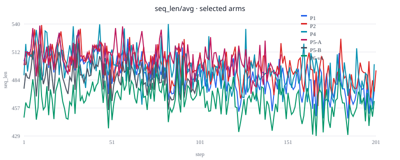

# k3-align Technical Report (P0–P6)

> Reading order: **§1 alignment table → §2 symbols → §4 phase knobs → §6 curves → §7–8 conclusions (Claims)**.  
> Detail tables: `P1_P2_COMPARE.md`, `P4_COMPARE.md`, `P5_COMPARE.md`, `P6_COMPARE.md`, `curves/COMPARE.md`, `boxed_*`.  
> **Repro:** [`REPRODUCIBILITY.md`](REPRODUCIBILITY.md) · `python3 scripts/verify_reported_results.py`.  
> Source ideas: Kimi K3 (arXiv:2607.24653) §4.1; stack: AReaL + vLLM + FSDP.  
> Formulas use Unicode + inline code (no `\(...\)`) to avoid preview mojibake.

One line: this repo is an **auditable approximate ablation of K3 §4.1** (outcome RL)—not full K3 / nine-expert / DPO / SFT main training.

---

## 1. Alignment table (this work · K3 · Diff)

How to read: left = what this repo actually does; middle = K3 / paper-side counterpart (§4.1 and public descriptions); right = **where equality must not be claimed**.

| Dimension | This experiment | K3 counterpart | Diff / do not claim |
|-----------|-----------------|----------------|---------------------|
| **Scope** | Small-model, runnable ablations of §4.1-style knobs | Full K3 training system (large data, many components) | Scale, data mix, and stack are not reproduced |
| **Model** | Qwen3-4B-Instruct | K3 proprietary large-model stack | Different model family; absolute scores are not comparable |
| **Paradigm** | Outcome RL (AReaL PPO-style) | Outcome RL + scheduling / distillation components | Same family; different stack and optimizer |
| **Optimizer** | Adam 1e-6 | Includes MuonClip etc. (paper stack) | **No MuonClip** |
| **Cold start** | Default Instruct; drop SFT if it regresses | Full cold-start / curriculum (paper side) | No regressing E0 on this line; no paper-scale curriculum |
| **Data** | Train `gsm8k_hard`; eval MATH boxed N=256 | Large multi-source math / reasoning data | **Orders of magnitude less data** |
| **Stabilizer recipe R** | Group-mean advantage + ratio mask `[α,β]` + `τ_R(Δlogπ)²` | K2.5-style structure | **Structure aligned; α/β/τ_R are placeholders, not paper-exact** |
| **Async / staleness** | Knob **H** = `max_head_offpolicyness` (P1:0→P2:4) | Bounded off-policy / async head | **H ≠ λ-partial**; only aligns “bounded staleness” |
| **λ-partial** | P4: `approx λ-partial`, stop admitting new rollouts after fraction **λ=0.5** | Paper λ for partial completion / window close (richer state machine) | **Weak approx**: auditable pause; no full sandbox; no unfinished-traj priority queue across steps |
| **Reasoning Effort** | P5: global **b0** + **τ_E** schedule; `T > τ_E·b0 ⇒ r=-1` | Per-prompt / multi-effort experts, full suite | **≠** full Effort: no `b0(x)`, no multi-expert; not DAPO overlong |
| **MOPD / OPD** | P6: `approx MOPD`, **single teacher=P1**, Eq.15 dense → advantage | Multi-teacher OPD / nine experts · domain routing · GRM | **≠** nine-expert MOPD; RKL double-count off; eng. extras: length-norm / xccl / pos-only |
| **Ablation method** | **One factor per phase** (P0→P6) | Paper reports system-level results | This is a **mechanism ablation lab**, not an end-to-end leaderboard reproduction |
| **Capability gate** | Same-batch MATH boxed; usual tolerance −2pp | Paper’s own eval and scale | Scores must not be compared to paper tables |
| **Wording** | Always `approx *` | Paper component names | `approx` = Diff already declared |

**One row per phase:**

| Phase | What this work aligns | K3 counterpart | Main Diff |
|-------|----------------------|----------------|-----------|
| P0 | Cold-start regression gate | Cold-start gate | Instruct vs SFT only |
| P1 | Sync + recipe R ceiling | §4.1 sync / stabilizer baseline | Placeholder hparams; small data |
| P2 | H=4 only | Async head | H is not λ |
| P3 | Sweep τ_R / mask | In-recipe robustness | Placeholder grid ≠ paper grid |
| P4 | λ=0.5 stop-admit | λ-partial | No full sandbox state machine |
| P5 | Global length hard gate | Reasoning Effort | No per-prompt / multi-expert |
| P6 | Single-teacher Eq.15 | MOPD | Not multi-teacher; v1–v4 are eng./signal fixes |

---

## 1.1 Value and open-source claims

Many Diffs **≠** no value. Value is not “I reproduced K3,” but **turning paper-scale knobs into switchable, auditable, failure-replayable open ablations**.

### What these runs show

| Type | Content |
|------|---------|
| **Separable mechanisms** | On one model/data/recipe base, H, λ, Effort, OPD can be **toggled alone** with audits—not locked inside a closed mega-system |
| **Quantitative tradeoffs** | H=4: +32% throughput for ~−3pp boxed; P1 stayed the ceiling until OPD signal was fixed |
| **Negative results first-class** | P6 v1–v3 (scale / disk / negative bias) document failure modes |
| **Ops reproducibility** | Actor/rollout split: disk→xccl; OPD needs length-norm + sign handling + (optional) warm-start |
| **Eval discipline** | Same-batch N=256 boxed; train correct ≠ capability (P5-B demonstrates) |

### Contributions to claim (suggested wording)

1. **One-factor ablation suite on an open RL stack (AReaL)** — P0–P6 protocol + smoke / boxed gates for K3-§4.1-style knobs, not end-to-end SOTA chasing.  
2. **Auditable approximate mechanisms** — `approx λ-partial` / `approx Effort` / `approx MOPD` with JSONL audits and explicit Diff vs paper namesakes.  
3. **Documented OPD failure modes + a working repair path** — scale blow-up, NFS disk sync timeouts, negative log-ratio bias under cold start; repair: length-norm + xccl + P1 warm-start + pos-only.  
4. **Multi-node async RL ops notes** — weight-sync choice when actor/rollout are split; preflight / graceful stop; same-batch eval + trial naming.  
5. **Negative-result culture as artifact** — VOID/FAIL trials kept in-repo, not only the winning ckpt.

### Elevator pitch (README)

> **k3-align** is an open, one-factor ablation lab for K3-§4.1-style RL knobs on AReaL: auditable *approximate* async-head, λ-stop, Effort gate, and single-teacher OPD—plus documented failure modes. It is **not** a K3 reproduction.

### Docs layout (shipped)

1. What / Claims → `README.md`  
2. Quickstart → `README.md`  
3. Phase map + this report + **`docs/curves/`**  
4. Citation / inspired-by, not a reproduction  

---

## 2. Symbol notes (what T / λ / τ control)

Same Greek letters mean different things on **different arms**—read this before §4.

### 2.1 Master table

| Symbol | Where | Controls | Values on this line |
|--------|-------|----------|---------------------|
| **Recipe R** | P1+ | K2.5-style stabilizer: group adv + ratio mask + `τ_R · (Δlog π)²` | Not a single scalar |
| **H** | P1–P6 | `max_head_offpolicyness`: max version gap of rollout vs train weights | P1=`0` (sync); P2+=`4` |
| **α, β** (mask) | Recipe R / P3 | Keep band for importance ratio `r = π_θ / π_old`; mask outside | Default `0.2` / `5.0` |
| **τ_R** (recipe τ) | Recipe R / **P3** | Loss quadratic coeff; limits π_θ drift from old | Default `0.01`; P3 sweeps `0` / `0.05` |
| **λ** | **P4** | Stop-admit fraction: after `λ · N · K` completed trajs, stop new rollouts | Fixed `0.5` on this arm |
| **T** | **P5** | Per-sample generation **length** (tokens); Effort gate observation | Same units as `max_new_tokens` |
| **b0** | **P5** | Global length budget base | `256` |
| **τ_E** (Effort τ) | **P5** | Effort schedule multiplier; budget `= τ_E · b0`; over → `reward=-1` | A:`2.0` → B:`1.0` (~100 steps each) |
| **Rmax** | **P6** | Clip half-width for `log π_T − log π_θ` in Eq.15 | `2.0` |
| **α_OPD** | **P6** | Scale of dense OPD into advantage (optionally `/T`) | v1=`0.05`; v2+=`0.5` |
| **pos-only** | P6 v4 | Keep only `r_opd > 0`; zero negative log-ratio | `K3_MOPD_POS_ONLY=1` |

### 2.2 Do not mix the two τ’s

| | **τ_R (P3 / recipe R)** | **τ_E (P5 Effort)** |
|--|-------------------------|---------------------|
| Acts on | **Train loss** | **Reward hard gate** |
| Larger → | Stronger penalty when π_θ leaves old | Looser budget, fewer −1 rewards |
| On this line | Default 0.01 is **not** the main cause of P2 drop | A barely fires; B ~97% over_budget |

### 2.3 Phase one-liners

- **P2** turns **H** · **P3** turns **τ_R / αβ** · **P4** turns **λ** · **P5** watches **T** via **τ_E·b0** · **P6** uses **Rmax / α_OPD** (v4 + pos-only)

---

## 3. Shared settings (inherited unless overridden)

| Item | Setting |
|------|---------|
| Model | `Qwen3-4B-Instruct-2507` |
| Paradigm | Outcome RL (AReaL PPO-style); primary reward gsm8k 0/1 |
| Cold start | Instruct (P0 pass); P6 v4 uses P1 warm-start |
| Data | `gsm8k_hard` |
| Recipe R | G=8; group-mean adv; mask `[0.2,5.0]`; τ_R=0.01; clip=0.2; `kl_ctl=0`; Adam 1e-6 |
| Train gen | `max_new_tokens=512`, temperature=1.0 |
| Eval | MATH boxed · N=256 · greedy · `max_tokens=1024` |
| Formal steps | 200 / arm (P5 ≈ 100+100) |
| Topology | Mainline ~20 GPU; P5+ default 24 GPU (`vllm:d4`+`fsdp:d20`, batch=160); P4=16 GPU |
| Capability gate | Usual −2pp vs designated baseline; most post-P2 vs P2; P6 vs max(P1,P2) |

Rule: **change one factor at a time**. `approx *` ≠ the paper’s full namesake system.

---

## 4. P0–P6 phase settings

Each arm: **relative to · one change · knobs · expectation · result**.

### 4.0 Overview

| Phase | Relative to | One change | Core knobs | Result (one line) |
|-------|-------------|------------|------------|-------------------|
| P0 | — | Cold-start source | Instruct vs SFT gate | Instruct 65.6% pass |
| P1 | P0 | RL + R + H=0 | H=0 | boxed **78.1–78.5%** |
| P2 | P1 | **H only** | H=4 | +32% throughput; boxed soft-fail |
| P3 | P2 | τ_R / mask | τ_R∈{0,0.05}, … | ≈P2 |
| P4 | P2 | +λ stop-admit | λ=0.5 | Mechanism pass; −1.95pp vs P2 |
| P5 | P2 | +Effort hard gate | b0=256; τ_E 2.0→1.0 | −2.1% len; +0.78pp vs P2 |
| P6 | P2 | +single-teacher OPD | §4.7; final v4 | **v4 PASS** +0.78pp vs P1 |

```text
Instruct (P0) → P1(H=0) → P2(H=4)
                              ├── P3 (τ_R/mask)
                              ├── P4 (+λ)
                              ├── P5 (+Effort)
                              └── P6 (+OPD, v1→v4)
```

---

### 4.1 P0 · Cold-start gate

| Item | Setting |
|------|---------|
| Relative to | — (gate, not main RL) |
| Decision | Init from Instruct vs gated SFT |
| Knobs | MATH boxed N≥256; SFT must be ≥ Instruct−2pp or discard |
| Not done | Force RL from a regressing E0 |
| Expectation | Pick a non-regressing cold start |
| This line | **Instruct** boxed **65.625%** (168/256) pass |

---

### 4.2 P1 · Sync baseline

| Item | Setting |
|------|---------|
| Relative to | P0 Instruct |
| One change | Outcome RL + **recipe R** + **H=0** on Instruct |
| Knobs | H=`0` (sync); recipe R defaults; 200 steps; no λ / Effort / OPD |
| Expectation | Capability ceiling; stale≈0 |
| Result | boxed **78.1%** (same-batch retest ~78.5%); sync reference upper bound |

---

### 4.3 P2 · Async-head

| Item | Setting |
|------|---------|
| Relative to | **P1** (all else equal) |
| One change | **H: 0 → 4** |
| Knobs | `max_head_offpolicyness=4`; recipe R unchanged; 200 steps |
| Expectation | Throughput↑, stale shifts to ~4; boxed may drop vs P1 |
| Result | Throughput **+32%** steps/h; stale≈4; boxed **75.0%** (vs P1 −3.1pp soft-fail; vs Instruct +9.4pp) |

---

### 4.4 P3 · αβτ sweep (inside recipe)

| Item | Setting |
|------|---------|
| Relative to | **P2** (H=4 fixed) |
| One change | In-recipe **τ_R** and/or **αβ mask** (not H, not reward def.) |
| Knobs | e.g. τ_R=`0` / `0.05`; tighter/looser mask |
| Note | This τ is **τ_R (loss)**, not P5’s τ_E |
| Expectation | Check whether R is brittle; too tight may hurt learning |
| Result | τ_R=0 ≈ P2 (boxed 75.78%) → default τ_R=0.01 is **not** the main cause of the P2 drop |

---

### 4.5 P4 · approx λ-partial

| Item | Setting |
|------|---------|
| Relative to | **P2** (H=4 + R) |
| One change | Add **completion-fraction stop-admit** |
| Knobs | **λ=`0.5`**: after half of the window’s target trajs complete, stop new rollouts → wait inflight → train → bump version; H unchanged |
| Topology note | 16 GPU, batch=168 (must divide DP) |
| Expectation | Auditable partial window; possible batch↓, stale→0; do not hard-compare throughput across GPU counts |
| Result | Per-step pause/train audits; boxed **74.2%** vs same-batch P2 76.2% (−1.95pp, inside gate) |

---

### 4.6 P5 · approx Effort

| Item | Setting |
|------|---------|
| Relative to | **P2** (H=4 + R, no λ) |
| One change | Add **length hard gate** on reward |
| Knobs | Observe gen length **T**; if `T > τ_E · b0` then `reward=-1`, else keep gsm8k |
| Schedule | **b0=`256`**; Stage A **τ_E=`2.0`** (~100 steps) → Stage B **τ_E=`1.0`** (~100 steps, warm-start A) |
| Note | Not DAPO overlong; if A’s budget ≥ `max_new_tokens`, gate barely fires |
| Expectation | Length↓; boxed ≥ P2−2pp; Stage B over_budget > A |
| Result | boxed **77.0%** (+0.78pp vs P2); length −2.1%; B over_budget **97%** (train correct collapses; boxed does not) |

---

### 4.7 P6 · approx MOPD (single teacher)

| Item | Setting |
|------|---------|
| Relative to | **P2** recipe base (H=4 + R); teacher fixed to **P1 final** |
| Add | Eq.15: `r_opd = clip(log π_P1 − log π_θ, ±Rmax)` → advantage; keep gsm8k outcome |
| Shared knobs | Rmax=`2.0`; `distill_loss_weight=0` (no RKL double-count); 24 GPU; 200 steps |
| Not done | Nine experts / GRM / multi-domain routing / λ / Effort |

**Four P6 versions:**

| Ver | Student / ref | α_OPD | length-norm | Sync | Other | Verdict |
|-----|---------------|-------|-------------|------|-------|---------|
| v1 | Instruct | 0.05 | off | disk | — | **VOID** (scale collapse + disk 500) |
| v2 | Instruct | 0.5 | **on** `/T` | disk | — | **VOID** (NFS 120s) |
| v3 | Instruct | 0.5 | on | **xccl** | bidirectional OPD | **FAIL** boxed 72.3% (−6.25pp) |
| **v4** | **P1 final** | 0.5 | on | xccl | **pos-only** | **PASS** boxed **79.30%** (+0.78pp vs P1) |

v3→v4: under cold start, raw log-ratio stays negative → mean_suffix≈−0.39 becomes a stable penalty; warm-start + inject only positive OPD.  
v4 restraint: `pos_frac≈5%`—prefer “H=4 RL near P1 without being dragged by negative OPD,” not “strong distillation fully on.”

---

## 5. Optimization path (two layers)

1. **Mainline:** P0→P1→P2, then attach P3/P4/P5/P6 (§4).  
2. **Inside P6:** v1→v4 fix scale / sync / signal direction (§4.7).

```text
v1 scale+disk → v2 len-norm still disk → v3 xccl but negative-bias drop → v4 warm-start+pos-only PASS
```

Details: `P6_PLAN.md`. Alignment Diff: **§1**.

---

## 6. Train convergence curves

Primary metric: `ppo_actor/task_reward/avg` (AReaL `main.log` StatsLogger tables).  
Full CSV / SVG / per-arm plots: [`docs/curves/COMPARE.md`](curves/COMPARE.md). P0 has no RL train curve (Instruct cold-start gate only).

### 6.1 How to read

| Figure | What to look for |
|--------|------------------|
| Mainline overlay | P1 highest late; P2/P3/P4 slightly lower but same-order climb; P6-v4 starts high from P1 warm-start |
| P6 overlay | v1→0 collapse; v2 abort; v3 finishes but late below P1; **v4** high plateau |
| seq_len overlay | P5 shortens somewhat; do **not** treat P5-B’s negative `task_reward` as capability |

### 6.2 Mainline and P6 overlays




### 6.3 Per-arm summary (first20 → last20)

| Label | Trial | n | first20 | last20 | last | Read |
|-------|-------|---|---------|--------|------|------|
| P1 | `p1-k25-sync-h0-full` | 200 | 0.379 | 0.468 | 0.535 | Sync ceiling; steady climb |
| P2 | `p2-k25-async-h4` | 201 | 0.379 | 0.447 | 0.500 | H=4: slightly below P1 late |
| P3-τ0 | `p3-h4-tau0` | 200 | 0.378 | 0.439 | 0.481 | ≈P2; τ_R not main drop cause |
| P3-τ0.05 | `p3-h4-tau005` | 237 | 0.375 | 0.422 | 0.454 | τ_R=0.05 sweep arm |
| P3-mask | `p3-h4-mask-tight` | 200 | 0.377 | 0.383 | 0.445 | Tight mask; lower late mean |
| P4 | `p4-h4-lambda05-16gpu` | 200 | 0.381 | 0.444 | 0.383 | λ stop-admit: noisier |
| P5-A | `p5-effort-tau2-24gpu` | 147 | 0.378 | 0.415 | 0.388 | τ_E=2; not a full 200 |
| P5-B | `p5-effort-tau1-24gpu` | 100 | −0.657 | −0.588 | −0.659 | Hard gate: train reward negative; judge by boxed |
| P6-v1 | `p6-mopd-p1teacher-24gpu` | 151 | 0.375 | 0.000 | 0.000 | VOID: collapse to 0 |
| P6-v2 | `…-v2` | 19 | 0.378 | 0.378 | 0.358 | VOID: early stop (~19 steps) |
| P6-v3 | `…-v3` | 200 | 0.377 | 0.431 | 0.464 | FAIL: full steps but below P1 |
| **P6-v4** | `…-v4` | 200 | **0.486** | **0.489** | **0.556** | PASS: warm-start high plateau |

P3 detail plots/CSV: `docs/curves/`. Rebuild: `python3 scripts/extract_train_curves.py …` → `python3 scripts/plot_train_curves.py`.

---

## 7. Boxed overview (N=256)

**Same-batch rule:** absolute % from different eval batches **must not** be cross-compared; batches are labeled below. Protocol: `MATH-lighteval` test · N=256 · seed=1 · greedy · `max_tokens=1024` · `scripts/math_boxed_probe.py`.

| Phase | boxed | Batch | Note |
|-------|-------|-------|------|
| Instruct (P0) | 65.625% (168/256) | `batch_p1_p2_p3` | Cold start C0 |
| P1 | **78.125%** (200/256) | `batch_p1_p2_p3` | Sync ceiling C1 |
| P2 | 75.000% (192/256) | `batch_p1_p2_p3` | vs P1 **−3.125pp** C2 |
| P3 τ_R=0 | 75.781% (194/256) | `batch_p1_p2_p3` | vs P2 +0.78pp C3 |
| P4 | 74.219% (190/256) | `batch_p4` | vs same-batch P2 76.172% → **−1.95pp** C4 |
| P5 | 76.953% (197/256) | `batch_p5` | vs same-batch P2 76.172% → **+0.78pp** C5 |
| P6 v3 | 72.266% (185/256) | `batch_p6_v4` (ref) | vs P1 −6.25pp · fail C6 |
| **P6 v4** | **79.297%** (203/256) | `batch_p6_v4` | vs same-batch P1 78.516% → **+0.78pp** C6 |

P6 v4 same-batch detail: P1 78.52% / P2 75.78% / v4 79.30% (len 522.9). See `P6_COMPARE.md`, `boxed_p6/compare_v4.json`.

Repro: [`REPRODUCIBILITY.md`](REPRODUCIBILITY.md) · `./scripts/verify.sh`.

---

## 8. Conclusions and boundaries

Each supported conclusion has a **Claim ID** in `docs/manifests/results_manifest.json`. Tier-1 checks in-repo artifacts; Tier-2 retrains with the same configs / seed / eval protocol.

| ID | Supported conclusion | Primary evidence |
|----|----------------------|------------------|
| **C0** | Instruct cold-start gate passes at 65.625% | `p0_gate/` + `boxed_p1_p2_p3/` |
| **C1** | R+Instruct → sync ceiling ~78% (P1) | `batch_p1_p2_p3` |
| **C2** | H=4: ~+32% throughput; boxed −3.125pp vs P1 (soft-fail) | `P1_P2_COMPARE` + same-batch boxed |
| **C3** | τ_R=0 ≈ P2 → default τ_R is not the main P2 drop cause | `batch_p1_p2_p3` |
| **C4** | approx λ=0.5 auditable; −1.95pp vs same-batch P2 · pass | `boxed_p4/compare.json` |
| **C5** | approx Effort: +0.78pp vs same-batch P2, length −2.1%; P5-B train reward negative ≠ capability | `boxed_p5/` + curves |
| **C6** | MOPD needs scale/sync/sign fixes; v3 fail, **v4 pass** (+0.78pp vs same-batch P1) | `boxed_p6/compare_v4.json` + curves |
| **C7** | §6 curve table matches `docs/curves/*.json` | `verify_reported_results.py` |

**Do not over-claim:** not a full K3 reproduction; H≠λ; v4 +0.78pp ≠ proven strong distillation; N=256 is noisy; absolute scores are not cross-batch comparable.

---

## 9. Wording checklist

- [ ] `approx λ-partial` / `approx Effort` / `approx MOPD`
- [ ] H not written as λ-partial; τ_R vs τ_E not mixed
- [ ] P6 single teacher=P1; v1–v4 spelled out
- [ ] Capability = same-batch N=256 boxed, not train correct
- [ ] Curves point to `docs/curves/`; no internal host paths
- [ ] Conclusions carry Claim IDs; `verify_reported_results.py` passes
- [ ] No cross-batch absolute boxed % comparisons

---

## 10. Related docs

| Doc | Content |
|-----|---------|
| `REPRODUCIBILITY.md` | **Tier-1/2 protocol + Claim map** |
| `manifests/results_manifest.json` | Claim → trial → expects / hashes |
| `curves/COMPARE.md` | **Convergence overlays + SVG** |
| `curves/README.md` | Extract / replot |
| `EXPERIMENT_DESIGN.md` | Design table |
| `P6_PLAN.md` | P6 knobs + four-version path |
| `P6_COMPARE.md` | v4 write-up |
| `P1_P2_COMPARE.md` / `P4_COMPARE.md` / `P5_COMPARE.md` | Per-arm compares |
| `boxed_p6/COMPARE.md` | P6 same-batch boxed |
| `JOB_QUEUE.md` | Queue notes |
