# Train convergence curves

Source: AReaL `main.log` StatsLogger ascii tables.
Primary metric: `ppo_actor/task_reward/avg`.
Secondary: `ppo_actor/seq_len/avg` (Effort / length story).

P0 has **no** RL train curve (Instruct cold-start gate only).

## How to read

- **Mainline overlay**: P1 / P2 / P3-τ0 / P4 / P5-A / P6-v4 on one canvas.
- **P6 overlay**: v1 collapse, v2 abort, v3 underperform, v4 warm high plateau.
- **P5-B**: negative `task_reward` follows from the hard Effort gate (97% over_budget); same-batch boxed MATH is the capability metric for C5.

## Overlay figures

### Mainline `task_reward`

### P6 versions `task_reward`

### Selected `seq_len`

## Summary table

| Label | Trial | n | first20 | last20 | last | Note |
|-------|-------|---|---------|--------|------|------|
| P1 | `p1-k25-sync-h0-full` | 200 | 0.3793 | 0.4682 | 0.5352 | Sync ceiling: reward climbs ~0.38→0.47 (first20→last20). |
| P2 | `p2-k25-async-h4` | 201 | 0.3791 | 0.4470 | 0.5000 | H=4: similar early rise; slightly lower late reward than P1. |
| P3-tau0 | `p3-h4-tau0` | 200 | 0.3782 | 0.4385 | 0.4805 | τ_R=0 ≈ P2 shape (recipe τ not the P2 drop cause). |
| P3-tau005 | `p3-h4-tau005` | 237 | 0.3752 | 0.4225 | 0.4539 | τ_R=0.05 sweep arm (longer log; compare to P2). |
| P3-mask | `p3-h4-mask-tight` | 200 | 0.3768 | 0.3825 | 0.4445 | Tighter ratio mask sweep; same H=4 base. |
| P4 | `p4-h4-lambda05-16gpu` | 200 | 0.3807 | 0.4442 | 0.3831 | λ=0.5 pause/train: reward plateaus with more step noise. |
| P5-A | `p5-effort-tau2-24gpu` | 147 | 0.3775 | 0.4151 | 0.3875 | τ_E=2.0: mild length pressure; reward still rising at stop (147 steps). |
| P5-B | `p5-effort-tau1-24gpu` | 100 | -0.6574 | -0.5882 | -0.6586 | τ_E=1.0: task_reward deeply negative (over_budget≈97%); boxed still held. |
| P6-v1 | `p6-mopd-p1teacher-24gpu` | 151 | 0.3750 | 0.0000 | 0.0000 | VOID: reward collapses to ~0 (scale / disk path). |
| P6-v2 | `p6-mopd-p1teacher-24gpu-v2` | 19 | 0.3781 | 0.3781 | 0.3578 | VOID: aborted early (~19 steps, NFS disk timeout). |
| P6-v3 | `p6-mopd-p1teacher-24gpu-v3` | 200 | 0.3769 | 0.4312 | 0.4641 | FAIL: trains to 200 but late reward below P1; negative OPD bias. |
| P6-v4 | `p6-mopd-p1teacher-24gpu-v4` | 200 | 0.4860 | 0.4887 | 0.5563 | PASS: P1 warm-start + pos-only; starts high (~0.49) and stays. |

## Per-trial plots

### P1 (`p1-k25-sync-h0-full`)

Sync ceiling: reward climbs ~0.38→0.47 (first20→last20).

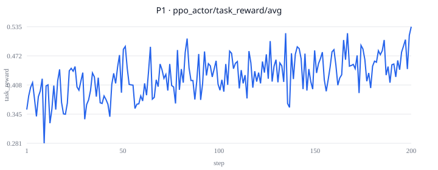

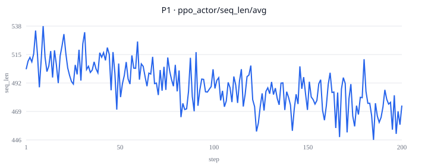

### P2 (`p2-k25-async-h4`)

H=4: similar early rise; slightly lower late reward than P1.

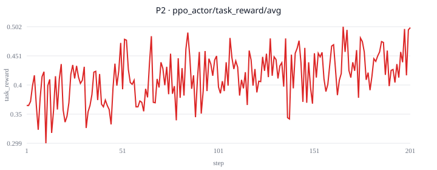

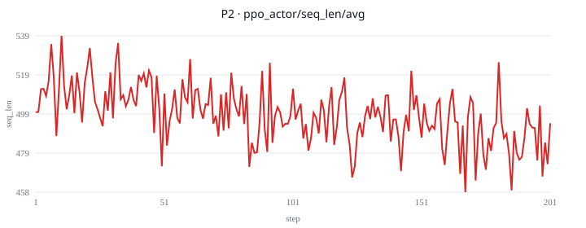

### P3-tau0 (`p3-h4-tau0`)

τ_R=0 ≈ P2 shape (recipe τ not the P2 drop cause).

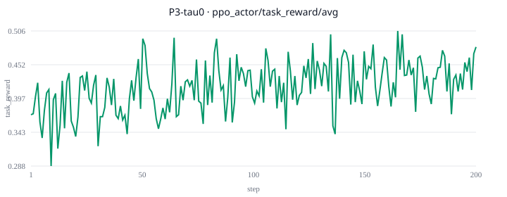

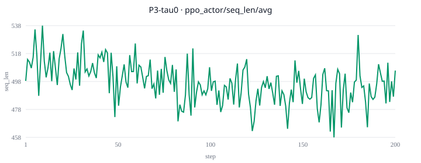

### P3-tau005 (`p3-h4-tau005`)

τ_R=0.05 sweep arm (longer log; compare to P2).

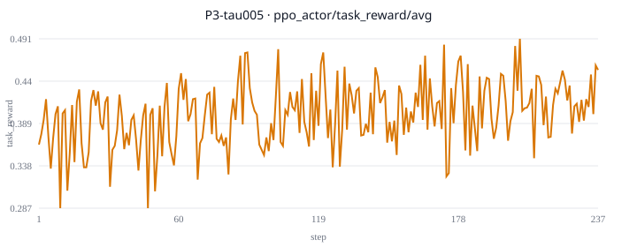

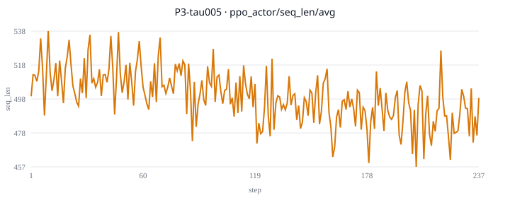

### P3-mask (`p3-h4-mask-tight`)

Tighter ratio mask sweep; same H=4 base.

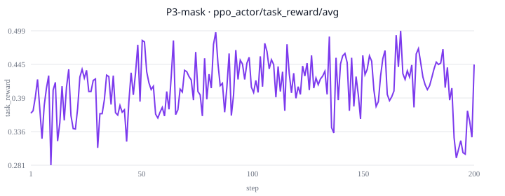

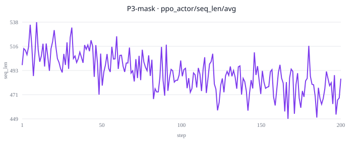

### P4 (`p4-h4-lambda05-16gpu`)

λ=0.5 pause/train: reward plateaus with more step noise.

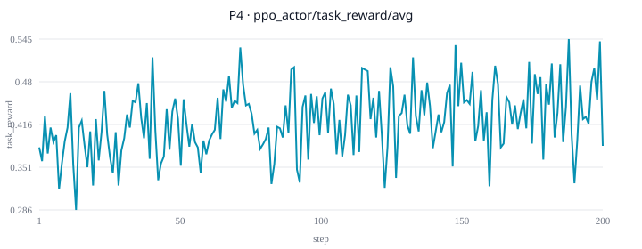

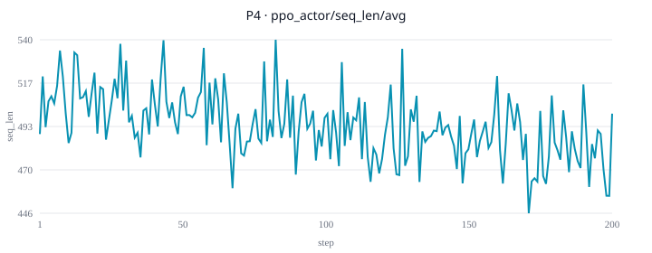

### P5-A (`p5-effort-tau2-24gpu`)

τ_E=2.0: mild length pressure; reward still rising at stop (147 steps).

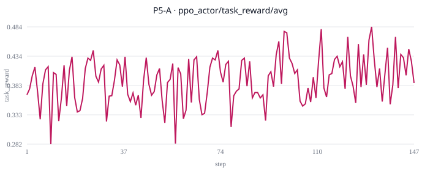

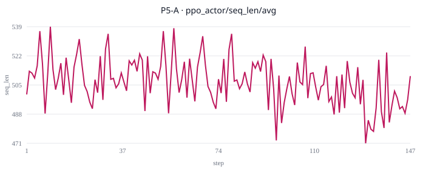

### P5-B (`p5-effort-tau1-24gpu`)

τ_E=1.0: task_reward deeply negative (over_budget≈97%); boxed still held.

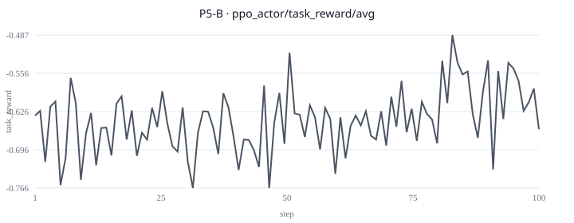

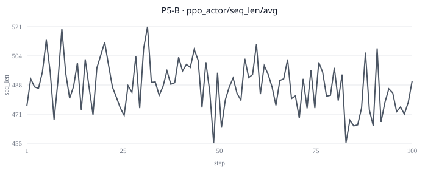

### P6-v1 (`p6-mopd-p1teacher-24gpu`)

VOID: reward collapses to ~0 (scale / disk path).

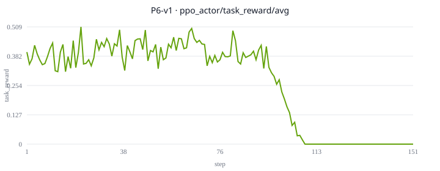

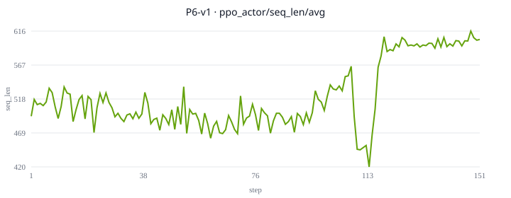

### P6-v2 (`p6-mopd-p1teacher-24gpu-v2`)

VOID: aborted early (~19 steps, NFS disk timeout).

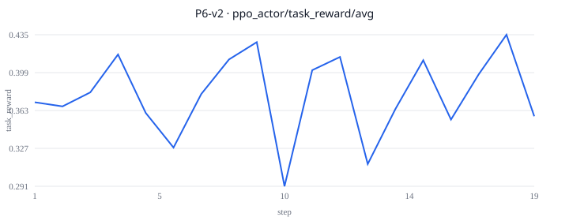

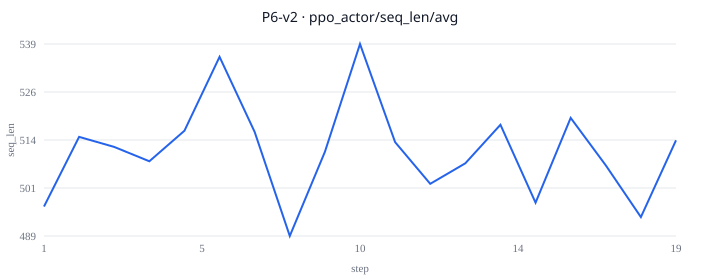

### P6-v3 (`p6-mopd-p1teacher-24gpu-v3`)

FAIL: trains to 200 but late reward below P1; negative OPD bias.

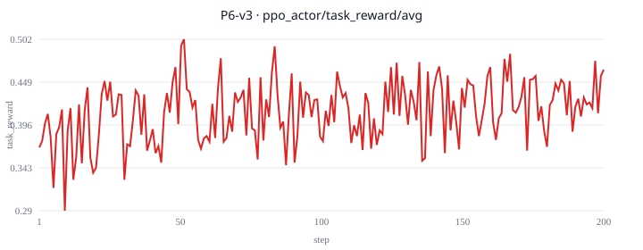

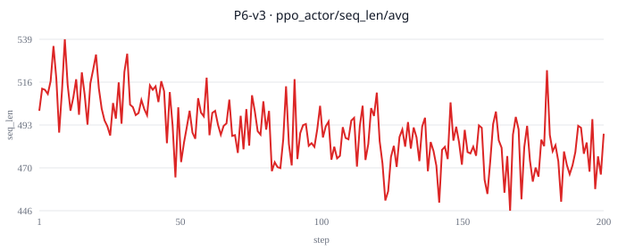

### P6-v4 (`p6-mopd-p1teacher-24gpu-v4`)

PASS: P1 warm-start + pos-only; starts high (~0.49) and stays.

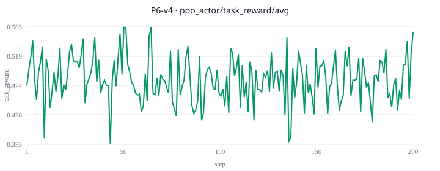

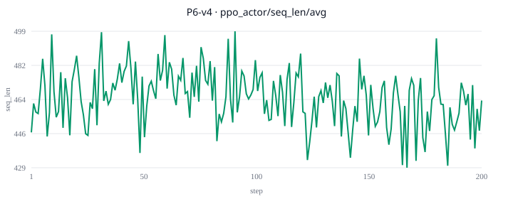

